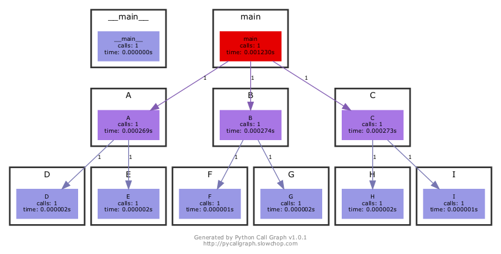
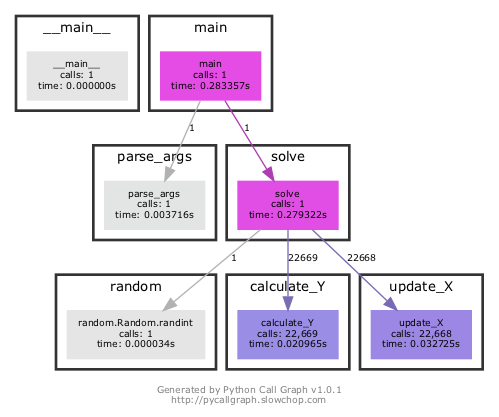

# Top-down programming for problem solving

&nbsp;

&nbsp;

&nbsp;

<div style="text-align: center"><b>Hui Chong</b><br/><br/>
Email: <a href="mailto:huichong.me@gmail.com">huichong.me@gmail.com<a><br/>
Website: <a href="https://www.huichong.me">https://www.huichong.me</a>
</div>

&nbsp;

&nbsp;

<div style="text-align: right">May 9, 2022<br/>
Big Data Biology Lab, <br/>
Institute of Science and Technology for Brain-inspired Intelligence, <br/>
Fudan University
</div>
---
## Programming for problem solving

### Why programming?

There are generally two ways to solve problems.

#### Manual operation

- Flexible: human can adapt to different problems.
- Error prone: human can make random mistakes.
- **But, what if you have to execute your solution over and over again in the future?**
- Human effort are **not** for those repetitive works.

#### Programming

- Less flexible: a program is built for only one kind of problems.
- **Easy to scale up**: It's just a series of pre-defined instructions to be executed by computers.

Not all problems can be solved by programming.

---
## Top-down programming & bottom-up testing

### What are the benefits?
- Clear code structure that is easy to understand by others.
- Coding is also a kind of commuication (e.g., collaborative developing).
- Easier to debug.
- Develop and test more efficiently without almost any extra cost.
- Top-down programming is independent of programming language. 


### How it works? 

- Split large problem into multiple smaller problems.
- Solve each smaller problem using a function/module.
- Assemble each submodule by bottom-up testing (especially when you're testing functions manually, not automatically).

---


## Function call graph

Function call graph can clearly show the structure of you program.



The example was generated by the [PyCallGraph](https://pycallgraph.readthedocs.io/en/master/index.html) package.

---
## How to apply top-down programming?

- Think about the structure while/before you write code.
- The main function goes on the top so that any new comer can see the structure of the script (like a table of content).
- Run `main()` inside `if __name__ == '__main__'` statement for easier test.

```python
def main():
    A(xxx)
    B(xxx)
    C(xxx)

def A(xxx):
    D(xxx)
    E(xxx)

......

def I(xxx):
  ......

if __name__ == '__main__':  
    main()
```

---
## Bottom-up testing and error analysis

- **Bottom-up testing**: you could know whether a module works by testing just itself (without testing its submodules).
- **Error analysis**: If a module cannot work but all its submodules work well, then the bug should be in the module.


---
## Example: Finding proximate squared root

Given an integer `Y`, what is the proximate value of `X` that satisfy `Y = X^2`?

#### Code

```python
def main():
    ......

def solve(y_expected, limit, step_size, x=None):
    if not x:
        x = random.randint(1, 1000)
    y_current = calculate_Y(x)
    diff = y_expected - y_current
    while abs(diff) >= limit:
        x = update_X(y_expected, y_current, x, step_size)
        y_current = calculate_Y(x)
    return x

def calculate_Y(x):
    return x * x

def update_X(y_expected, y_current, x, step_size):
    return x - (-2 * x * step_size)

if __name__ == '__main__':
    main()
```

---

## Example: Buttom-up testing
<!-- Function call graph:  -->

<!--  -->
Let's test these functions.

```python
import simple_gd_sqrt as sqrt_test


# Test calculate_Y
assert sqrt_test.calculate_Y(x=3) == 9
assert sqrt_test.calculate_Y(x=-3) == 9


# Test update_X
# Rule: X = X - d|y_expected - x**2|/dx * step_size
# d|y_expected - x**2|/dx = -2 * x (when y_expected >= x**2) 
#                         or 2 * x (when y_expected < x**2)
updated_X = sqrt_test.update_X(y_expected=9, y_current=4, x=2, step_size=0.0001)
assert updated_X == 2 + 2 * 2 * 0.0001

updated_X = sqrt_test.update_X(y_expected=9, y_current=16, x=4, step_size=0.0001)
assert updated_X == 4 - 2 * 4 * 0.0001


# Test solve
y_current = sqrt_test.solve(x=10, y_expected=9, limit=0.01, step_size=0.0001)
assert abs(y_current - 3) < 0.01
y_current = sqrt_test.solve(x=1, y_expected=9, limit=0.01, step_size=0.0001)
assert abs(y_current - 3) < 0.01
```